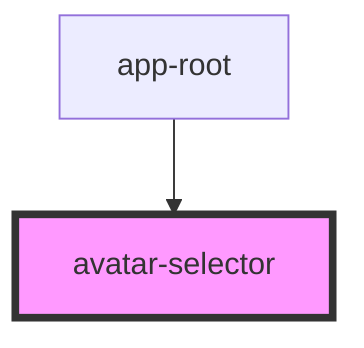

# avatar-selector

<!-- Auto Generated Below -->

## Properties

| Property   | Attribute | Description | Type                          | Default     |
| ---------- | --------- | ----------- | ----------------------------- | ----------- |
| `onSelect` | --        |             | `(avatarUrl: string) => void` | `undefined` |

## Dependencies

### Used by

 - [app-root](../app-root)

### Graph

----------------------------------------------

*Built with [StencilJS](https://stenciljs.com/)*
